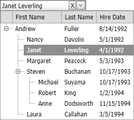

<!-- default badges list -->

<!-- default badges end -->

# DropDown Edit for ASP.NET Web Forms - How to implement ASPxTreeList inside window template
<!-- run online -->
**[[Run Online]](https://codecentral.devexpress.com/e2854/)**
<!-- run online end -->

This example demonstrates how to embed [ASPxTreeList](https://docs.devexpress.com/AspNet/DevExpress.Web.ASPxTreeList.ASPxTreeList) into [ASPxDropDownEdit](https://docs.devexpress.com/AspNet/DevExpress.Web.ASPxDropDownEdit)'s dropdown window template. Click on a node within the [ASPxTreeList](https://docs.devexpress.com/AspNet/DevExpress.Web.ASPxTreeList.ASPxTreeList) changes the editor's value.

## Files to Review

* [Default.aspx](./CS/WebSite/Default.aspx) (VB: [Default.aspx](./VB/WebSite/Default.aspx))
* [Default.aspx.cs](./CS/WebSite/Default.aspx.cs) (VB: [Default.aspx.vb](./VB/WebSite/Default.aspx.vb))
